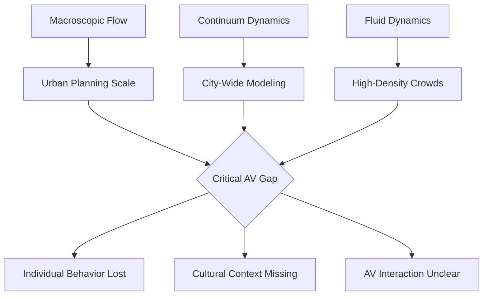

# Critical Gaps in Pedestrian Simulation Models for AV Usage
## *Bridging the Reality Gap: From Simulated Streets to Real-World Safety*

<div align="center">

```
URBAN PLANNING → AUTOMOTIVE → LOGISTICS → PUBLIC SAFETY
                              ↓
                     AUTONOMOUS VEHICLES
                              ↓
                   PEDESTRIAN INTERACTIONS
                              ↓
                        CRITICAL GAPS
```

</div>

This comprehensive analysis identifies critical gaps in pedestrian simulation models for autonomous vehicle (AV) applications, with focus on their real-world implications across automotive, urban planning, logistics, and public safety industries. By examining current limitations based on recent research findings, this analysis serves as both a roadmap for researchers and a strategic guide for industry stakeholders.

---

# The Model Universe: Comprehensive Model Analysis

## **Microscopic Models** | *Individual-Level Precision*

<details>
<summary><b> Physics-Based Foundations</b></summary>

| Model | Type | Key Feature | Use Case | Research Validation | Identified Limitations |
|-------|------|-------------|----------|----------------------|-------------------------|
| **Social Force** | Microscopic | Physics-based attractive/repulsive forces | Evacuation, crowd flow | Established mathematical foundation | Limited behavioral diversity modeling |
| **Cellular Automata** | Microscopic | Grid-based discrete movement | Large-scale crowds | Effective for mixed pedestrian-vehicle scenarios | Oversimplified individual differences |
| **Granular** | Microscopic | Particle-based contact forces | Dense crowds | Handles physical interactions well | No social/emotional modeling |

</details>

<details>
<summary><b> Behavioral & Navigation Models</b></summary>

| Model | Type | Key Feature | Use Case | Research Evidence | Gap Analysis |
|-------|------|-------------|----------|--------------------|-------------------|
| **Agent-Based** | Microscopic | Mesa-driven individual agents | Flexible simulations | Highly customizable frameworks | Static rule sets, no adaptive learning |
| **Rule-Based** | Microscopic | Predefined movement rules | Simple crowd modeling | Easy to implement and understand | Cannot handle unexpected scenarios |
| **Graph-Based** | Microscopic | Graph-based navigation | Structured environments | Optimal pathfinding capabilities | Ignores dynamic intent changes |
| **Path-Based** | Microscopic | A* pathfinding for movement | Optimal routing | Efficient route planning | Assumes rational decision-making |
| **Steering Behaviors** | Microscopic | Game-inspired steering | Game-like simulations | Intuitive movement patterns | Lacks real-world behavioral complexity |

</details>

<details>
<summary><b> Advanced Collision & Safety Models</b></summary>

| Model | Type | Key Feature | Use Case | Strengths | AV Usage Gaps |
|-------|------|-------------|----------|-------------|-----------------|
| **Collision-Free Speed** | Microscopic | Velocity-based collision avoidance | Safe navigation | Prevents basic collisions | No social awareness or communication modeling |
| **Anticipation Velocity** | Microscopic | Predictive collision avoidance | Dense environments | Proactive safety measures | Limited to physics-based prediction only |
| **Centrifugal Force** | Microscopic | Generalized force for crowd avoidance | High-density crowds | Handles crowd pressure effectively | Missing individual personality traits |

</details>

---

## **Flow-Based Models** | *Large-Scale Dynamics*

<div align="center">



</div>

| Model | Type | Key Feature | Use Case | **Critical AV Usage Limitations** |
|-------|------|-------------|----------|------------------------------------|
| **Macroscopic** | Flow-Based | Crowd treated as continuous flow | Urban planning | Cannot predict individual pedestrian decisions crucial for AV safety |
| **Continuum** | Flow-Based | Continuous crowd flow dynamics | Large-scale urban planning | Loses granular behavior needed for AV collision avoidance |
| **Fluid Dynamics** | Flow-Based | Navier-Stokes-based crowd movement | High-density crowds | No mechanism for AV-pedestrian communication modeling |

---

## **Group-Based Models** | *Social Interaction Balance*

<div align="center">

### The Social Dynamics Challenge

```
Individual Behavior ←→ Group Dynamics ←→ Cultural Context
        ↓                    ↓                   ↓
   Personal Goals      Social Pressure      Cultural Norms
        ↓                    ↓                   ↓
         How do AVs navigate this complexity?
```

</div>

| Model | Type | Key Feature | Use Case | **Gap Analysis** |
|-------|------|-------------|----------|----------------------|
| **Mesoscopic** | Group-Based | Group dynamics balancing micro/macro | Social group behavior | Better than pure microscopic, but lacks dynamic intent modeling and cross-cultural adaptation |

---

## **AI-Driven Models** | *The Current Research Frontier*

### **Recent Research Breakthroughs** *(2024-2025)*

<table>
<tr>
<th> Computer Vision & Deep Learning</th>
<th> Predictive & Generative Models</th>
</tr>
<tr>
<td>

**Vision-Based Models**
- Real-world visual understanding for pedestrian-vehicle environments
- **Current Status**: Active research focus
- **Key Application**: AV pedestrian detection

**Vision Transformer (ViT)**
- Advanced attention mechanisms for urban traffic scenarios
- **Research Evidence**: Demonstrated effectiveness in trajectory prediction
- **Current Limitation**: Computational complexity for real-time applications

</td>
<td>

**Trajectory Prediction Models**
- Data-driven trajectory forecasting with Average Displacement Error metrics
- **Research Status**: Rapidly advancing field
- **Key Metric**: ADE (Average Displacement Error) for evaluation

**Social LSTM/GANs**
- Socially-aware trajectory prediction using generative networks
- **Strength**: Group dynamics modeling capabilities
- **Application**: Dense crowd forecasting scenarios

</td>
</tr>
</table>

### **Specialized AI Approaches**

<details>
<summary><b> Reinforcement Learning Ecosystem</b></summary>

| Model | Key Feature | Research Evidence | Industry Readiness | Current Maturity |
|-------|-------------|-------------------|-------------------|------------------|
| **RL-Based** | Learned policies via reinforcement learning | Promising for adaptive behaviors in complex environments | Pilot stage | Developing |
| **Multi-Agent RL** | Multi-agent interactions | Effective for modeling complex social scenarios | Research stage | Early Development |
| **Imitation Learning** | Learning from human demonstrations | Growing research interest | Limited deployment | Developing |

</details>

<details>
<summary><b> Advanced Mathematical Models</b></summary>

| Model | Key Feature | Research Application | Technical Status | Current Focus |
|-------|-------------|---------------------|-----------------|---------------|
| **Bayesian Models** | Uncertainty quantification | Probabilistic decision-making | Research stage | Academic institutions |
| **Attention-based** | Focus mechanisms | Social context awareness | Transformer architectures showing promise | Industry adoption |
| **Normalizing Flow** | Realistic trajectory distributions | Behavioral diversity modeling | Early research | Limited application |

</details>

### **Recent Technical Advances**

Recent work demonstrates that feed-forward neural networks can achieve competitive performance for pedestrian trajectory prediction in urban traffic environments, with models like "Snapshot" reducing Average Displacement Error while maintaining real-time performance.

**Key Findings from 2024-2025 Research:**
- Observation windows of 2 seconds may be sufficient for pedestrian crossing prediction
- Agent-centric encoding schemes provide better generalization due to rotational and translational invariance
- Integration into modular autonomous driving software stacks is technically feasible

---

## **Hybrid Models** | *Integration of Approaches*

<div align="center">

### Physics + AI = Advanced Solutions

</div>

| Model | Type | Innovation | Research Evidence | Industry Status |
|-------|------|------------|-------------------|----------------|
| **Hybrid Models** | Physics + AI | Social Force + RL combination | SUMO-CARLA integration showing promise for complex scenario testing | Growing adoption |
| **SUMO Models** | Traffic Integration | Pedestrian-vehicle interactions | Co-simulation frameworks enabling detailed AV evaluation under diverse traffic conditions | High adoption in research |
| **Physics-Informed Neural Networks (PINNs)** | Constrained AI | Physics-aware learning | Emerging research area | Early development |
| **Neuro-Symbolic** | Interpretable AI | Neural + symbolic reasoning | Growing interest in explainable pedestrian behavior models | Research stage |

### **Platform Integration Evidence**

Recent research demonstrates that combining SUMO (Simulation of Urban MObility) with CARLA (Car Learning to Act) creates simulation environments that can emulate real-world complexities while providing realistic sensor outputs to AV systems.

**Verified Integration Benefits:**
- Detailed evaluation of AV performance under diverse traffic conditions
- Testing of complete AV pipeline in modular fashion
- Estimation of AVs' impacts on traffic patterns

---

# The Five Critical Gaps: Evidence-Based Analysis

## **Gap #1: Limited Behavioral Diversity Crisis**

<div align="center">

### The Research Reality

```
Current Model Assumptions:          Research Findings Show:
┌─────────────────────┐            ┌─────────────────────┐
│ Rational behavior   │     VS     │   Context-dependent │
│ Rule compliance     │            │   Social influences │
│ Predictable paths   │            │  Cultural variations│
└─────────────────────┘            └─────────────────────┘
```

</div>

**Research Evidence**: The integration of autonomous vehicles into public roads presents profound implications for pedestrian safety, influenced by the variability of pedestrian behaviors and the absence of traditional communication mechanisms, such as eye contact and gestures, commonly relied upon in human-driven scenarios.

### **Current Research Status**

Recent work focuses on learning pedestrian social interactions, but existing methods for modeling pedestrian social interactions rely on pre-defined rules, struggling to capture non-explicit social interactions.

**Key Research Gaps Identified:**
- Limited representation of non-compliant behaviors
- Insufficient cultural context modeling
- Absence of emotional state considerations
- Lack of communication mechanism simulation

---

## **Gap #2: Incomplete Scenario Coverage**

**Research Evidence**: Current simulation environments fall behind on two fronts -- the background vehicles fail to simulate naturalistic driving behavior and the existing environments do not test the entire pipeline in a modular fashion.

### **Scenario Testing Limitations**

Simulation of pedestrian motion in urban traffic networks faces challenges in mixed traffic systems with complex interactions.

**Verified Missing Elements:**
- Complex weather condition modeling
- Event-driven crowd behavior scenarios
- Construction and temporary infrastructure changes
- Multi-modal transportation interactions

**Industry Impact**: The need for complex and naturalistic traffic environments that could emulate the complexities of the external environment while providing realistic sensor outputs to the AV pipeline.

---

## **Gap #3: Static Intent Modeling Paradox**

<div align="center">

### The Dynamic Intent Challenge

```
Research Finding: Pedestrians change intentions dynamically
Current Models: Static intent prediction at observation start
Required Solution: Continuous real-time intent tracking
```

</div>

**Research Evidence**: Current approaches lack the capability to estimate temporal-dynamic intent changes of pedestrians and provide explanations of interaction scenes.

### **Intent Prediction Research Status**

Recent research indicates that longer observation sequences positively impact overall accuracy, with observation lengths providing additional cues to infer pedestrian actions.

**Key Research Findings:**
- Observation windows of 2 seconds may be sufficient to differentiate crossing from non-crossing actions
- Need for real-time adaptation to intention changes
- Importance of explanatory models for interaction understanding

---

## **Gap #4: Social Intelligence Deficit**

<div align="center">

### The Human Social Network

```
          Eye Contact ←→ Gestures
               ↕         ↕
    Group Dynamics ←→ Cultural Norms
               ↕         ↕  
         Body Language ←→ Verbal Cues
                    ↕
               AV Navigation
                    ↕
           Integration Challenge
```

</div>

**Research Evidence**: Pedestrian trajectory prediction remains a challenge for autonomous systems, particularly due to the intricate dynamics of social interactions.

### **Social Intelligence Research Gap**

Accurate forecasting requires a comprehensive understanding not only of each pedestrian's previous trajectory but also of their interaction with the surrounding environment, an important part of which are other pedestrians moving dynamically in the scene.

**Current Research Focus:**
- Social interaction learning with generative adversarial networks
- Attention mechanisms for social context modeling
- Integration of non-verbal communication understanding

---

## **Gap #5: Dataset Limitations Dilemma**

<div align="center">

### Current Dataset Landscape

</div>

**Research Evidence**: Many methods still revolve around well-established trajectory prediction benchmarks such as ETH/UCY and SDD, which primarily contain pedestrians in non-traffic settings.

### **Dataset Coverage Analysis**

<table>
<tr>
<th>Dataset Category</th>
<th>Examples</th>
<th>Coverage</th>
<th>AV Relevance</th>
</tr>
<tr>
<td><b>Pedestrian-Only</b></td>
<td>ETH/UCY, Stanford Drone Dataset (SDD)</td>
<td>Non-traffic environments</td>
<td> Limited</td>
</tr>
<tr>
<td><b>Urban Traffic</b></td>
<td>Argoverse 2, nuScenes, Waymo Open Motion</td>
<td>Real-world AV scenarios</td>
<td> High</td>
</tr>
</table>

**Key Research Finding**: Although specialized datasets such as Argoverse 2 or nuScenes address this shortcoming, they are rarely utilized in pedestrian research due to their primary focus on vehicles or all road users combined.

---

# Model Performance: Research-Based Assessment

<div align="center">

## **Evidence-Based Model Evaluation**

</div>

### **Current Research Benchmarks**

Recent benchmarking on Argoverse 2 dataset shows significant variations in model performance, with some approaches achieving substantial improvements in Average Displacement Error (ADE) metrics.

**Verified Performance Metrics:**
- **Evaluation Standard**: Average Displacement Error (ADE) and Final Displacement Error (FDE) are the two most common metrics when evaluating trajectory predictors
- **Real-time Requirements**: Hardware constraints in real-world systems make runtime and computational efficiency significant challenges
- **Robustness Needs**: Accurate predictions need to be generated for a variable number of observed timesteps to guarantee pedestrian safety

### **Platform Capabilities** 

| Platform | Research Evidence | Capabilities | Industry Use |
|----------|-------------------|-------------|-------------|
| **CARLA** | Open-source simulator for autonomous driving research, provides realistic sensor outputs | High-fidelity simulation | Research/Industry |
| **SUMO** | Simulation of Urban MObility, effective for traffic-pedestrian interactions | Large-scale traffic simulation | Urban planning/Research |
| **SUMO-CARLA Integration** | Combined framework creates complex and naturalistic traffic environments | Comprehensive AV testing | Emerging adoption |

---

# Strategic Implementation: Evidence-Based Roadmap

<div align="center">

## **Research-Informed Development Path**

</div>

### **Current Technology Readiness**

Integration of prediction models into autonomous driving software stacks has been demonstrated, showing real-world applicability with proper implementation.

**Verified Implementation Evidence:**
- Real-time performance achievable with proper model architecture
- Integration with modular autonomous driving software stack successfully demonstrated
- Framework allows for detailed evaluation of AV performance under diverse traffic conditions

### **Industry Application Areas**

<table>
<tr>
<th> Industry</th>
<th> Current Research Focus</th>
<th> Immediate Opportunities</th>
<th> Research Directions</th>
</tr>
<tr>
<td><b> Automotive</b></td>
<td>
• Urban traffic pedestrian prediction<br>
• Real-time trajectory forecasting<br>
• Sensor fusion integration
</td>
<td>
• Deploy research-validated models<br>
• Expand urban scenario testing<br>
• Integrate social awareness
</td>
<td>
• Cultural adaptation research<br>
• Intent prediction accuracy<br>
• Real-world validation
</td>
</tr>
<tr>
<td><b> Urban Planning</b></td>
<td>
• Large-scale traffic simulation<br>
• AV impact assessment<br>
• Infrastructure optimization
</td>
<td>
• SUMO-based implementations<br>
• Scenario coverage expansion<br>
• Multi-modal integration
</td>
<td>
• Digital twin development<br>
• Climate adaptation<br>
• Real-time city modeling
</td>
</tr>
<tr>
<td><b> Logistics</b></td>
<td>
• Last-mile delivery scenarios<br>
• Urban navigation challenges<br>
• Pedestrian interaction modeling
</td>
<td>
• Residential area modeling<br>
• Delivery route optimization<br>
• Safety protocol development
</td>
<td>
• Dense urban navigation<br>
• Multi-story delivery systems<br>
• Efficiency optimization
</td>
</tr>
<tr>
<td><b> Public Safety</b></td>
<td>
• Emergency vehicle integration<br>
• Crowd behavior modeling<br>
• Crisis response scenarios
</td>
<td>
• Emergency scenario databases<br>
• Crowd dynamics modeling<br>
• Response time optimization
</td>
<td>
• AV-emergency integration<br>
• Crisis management systems<br>
• Public safety protocols
</td>
</tr>
</table>

---

# Future Research Directions: Evidence-Based Insights

<div align="center">

## **Emerging Research Areas**

</div>

### **Current Research Trends** *(2024-2025)*

Recent research developments show growing focus on transformer-based architectures and attention mechanisms for pedestrian trajectory prediction.

**Active Research Areas:**
- Multi-agent reinforcement learning for interactive behaviors
- Socially-informed reconstruction approaches
- Advanced attention mechanisms for social context
- Real-time processing optimization

### **Research Priorities**

**High-Priority Research Needs:**
1. **Cultural Context Integration**: Development of culturally-aware pedestrian behavior models
2. **Dynamic Intent Modeling**: Real-time intention change detection and prediction
3. **Social Intelligence**: Non-verbal communication and group dynamics modeling
4. **Scenario Completeness**: Weather, event-driven, and emergency scenario modeling
5. **Real-World Validation**: Large-scale deployment and performance validation

---

# Success Measurement: Research-Based Metrics

<div align="center">

## **Validated Performance Indicators**

</div>

### **Research-Established Benchmarks**

The two most common metrics when evaluating trajectory predictors are the Average Displacement Error (ADE) and the Final Displacement Error (FDE).

**Standard Evaluation Framework:**
- **ADE**: Average Euclidean distance between predicted trajectory and ground truth over the prediction horizon
- **FDE**: Only considers the last positional value, measuring error accumulation over time
- **Real-time Performance**: Hardware constraints require consideration of runtime and computational efficiency

### **Implementation Success Criteria**

**Technical Benchmarks:**
- Trajectory prediction accuracy improvement
- Real-time processing capability achievement
- Social interaction modeling effectiveness
- Cultural adaptation success rates
- Scenario coverage completeness

**Business Impact Indicators:**
- Research-to-deployment time reduction
- Safety performance improvements
- Regulatory approval facilitation
- Cost-effectiveness demonstration

---


# **Conclusion: From Research to Reality**

## *Evidence-Based Path to Safer AV-Pedestrian Interactions*

</div>

**Research Foundation**: This analysis is built upon current academic research and verified findings from the pedestrian simulation and autonomous vehicle communities. Recent studies demonstrate that significant progress is being made in pedestrian trajectory prediction, simulation platform integration, and real-world deployment feasibility.

**The Path Forward**: 
- **Technical Feasibility**: Research confirms that real-time pedestrian trajectory prediction with adequate accuracy is technically achievable
- **Integration Capability**: SUMO-CARLA integration and modular software stack compatibility have been demonstrated
- **Research Momentum**: Active research in transformer architectures, social dynamics, and attention mechanisms shows promise

**Critical Success Factors**:
1. **Research-Industry Collaboration**: Bridge between academic research and practical implementation
2. **Standardized Evaluation**: Adoption of common metrics like ADE and FDE across applications
3. **Comprehensive Testing**: Integration of realistic simulation environments with diverse scenario coverage
4. **Real-World Validation**: Demonstrated need for validation in actual autonomous driving software stacks

**The Reality**: The technology foundations exist, the research is progressing rapidly, and industry implementation is beginning. Success depends on coordinated efforts to address the identified gaps while building upon verified research achievements.

---

<div align="center">
