# Critical Gaps in Pedestrian Simulation Models for AV Usage
## *Bridging the Reality Gap: From Simulated Streets to Real-World Safety*

<div align="center">

```
URBAN PLANNING → AUTOMOTIVE → LOGISTICS → PUBLIC SAFETY
                              ↓
                     AUTONOMOUS VEHICLES
                              ↓
                   PEDESTRIAN INTERACTIONS
                              ↓
                        CRITICAL GAPS
```

</div>

This comprehensive analysis identifies critical gaps in pedestrian simulation models for autonomous vehicle (AV) applications, with focus on their real-world implications across automotive, urban planning, logistics, and public safety industries. By examining current limitations based on recent research findings, this analysis serves as both a roadmap for researchers and a strategic guide for industry stakeholders.

---

# Technical Glossary

*Essential terms for understanding pedestrian simulation models and autonomous vehicle integration*

## **Artificial Intelligence & Machine Learning**

### **Core AI Concepts**

<table>
<tr>
<td width="25%"><b>Attention Mechanisms</b></td>
<td>AI techniques that allow models to focus on relevant parts of input data, similar to human attention. In pedestrian prediction, this helps models identify which pedestrians or environmental features are most important for forecasting behavior.</td>
</tr>

<tr>
<td><b>Generative Adversarial Networks (GANs)</b></td>
<td>A machine learning architecture where two neural networks compete: one generates fake data while the other tries to detect fakes. Used in pedestrian modeling to create realistic trajectory predictions and synthetic training data.</td>
</tr>

<tr>
<td><b>Reinforcement Learning (RL)</b></td>
<td>A type of machine learning where an AI agent learns optimal behavior through trial and error, receiving rewards or penalties. Applied to pedestrian simulation for learning complex walking patterns and decision-making strategies.</td>
</tr>

<tr>
<td><b>Transformer-Based Architectures</b></td>
<td>Advanced neural network designs originally created for language processing, now adapted for pedestrian trajectory prediction. They excel at understanding sequences and relationships in movement patterns over time.</td>
</tr>

<tr>
<td><b>Multi-Agent Reinforcement Learning</b></td>
<td>Extension of RL where multiple AI agents (representing different pedestrians) learn simultaneously, discovering how to interact and coordinate their behaviors in shared environments.</td>
</tr>
</table>

### **Specialized AI Models**

<table>
<tr>
<td width="25%"><b>Social LSTM</b></td>
<td>Long Short-Term Memory networks enhanced to model social interactions between pedestrians. They predict individual trajectories while considering the influence of nearby people's movements.</td>
</tr>

<tr>
<td><b>Bayesian Models</b></td>
<td>Statistical models that quantify uncertainty in predictions by calculating probabilities rather than single answers. Crucial for safety-critical AV applications where confidence levels matter.</td>
</tr>

<tr>
<td><b>Temporal Convolutional Networks (TCNs)</b></td>
<td>Neural networks specialized for processing time-series data, designed to capture long-term dependencies in pedestrian movement patterns and predict future behavior changes.</td>
</tr>

<tr>
<td><b>Physics-Informed Neural Networks (PINNs)</b></td>
<td>Neural networks that incorporate physical laws and constraints into their learning process, ensuring predictions follow realistic movement physics.
</td>
</tr>

</table>

---

## **Metrics & Evaluation Standards**

<div align="center">

### **Primary Performance Indicators**

</div>

<table>
<tr>
<td width="30%"><b>Average Displacement Error (ADE)</b></td>
<td>The average distance between predicted and actual pedestrian positions throughout the entire prediction timeline. Lower values indicate more accurate trajectory forecasting. <em>Target: < 0.5m for AV applications</em></td>
</tr>

<tr>
<td><b>Final Displacement Error (FDE)</b></td>
<td>The distance between predicted and actual final destination points. Measures how well models predict where pedestrians will end up. <em>Target: < 1.0m for safety-critical systems</em></td>
</tr>

<tr>
<td><b>Real-time Processing</b></td>
<td>The ability to analyze and predict pedestrian behavior fast enough for immediate AV decision-making. <em>Requirement: Complete analysis in < 100ms</em></td>
</tr>
</table>

### **Advanced Evaluation Concepts**

<div align="center">

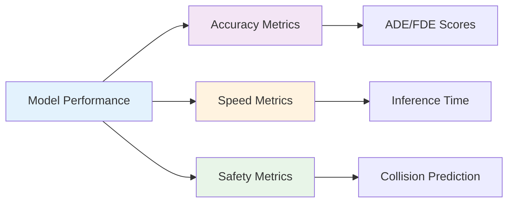

</div>

---

## **Simulation Frameworks & Platforms**

### **Core Simulation Tools**

<table>
<tr>
<td width="25%"><b>CARLA</b></td>
<td><strong>C</strong>ar <strong>L</strong>earning to <strong>A</strong>ct - An open-source simulator providing photorealistic environments for testing autonomous vehicles, including pedestrian interactions with realistic sensor outputs.</td>
</tr>

<tr>
<td><b>SUMO</b></td>
<td><strong>S</strong>imulation of <strong>U</strong>rban <strong>M</strong>o<strong>bility</strong> - A traffic simulation package designed for handling large road networks, enabling detailed analysis of pedestrian-vehicle interactions in urban environments.</td>
</tr>

<tr>
<td><b>SUMO-CARLA Integration</b></td>
<td>Combined framework linking SUMO's traffic management with CARLA's realistic visualization, creating comprehensive testing environments that simulate both large-scale traffic patterns and detailed sensor interactions.</td>
</tr>
</table>

### **Model Types Explained**

<table>
<tr>
<td width="25%"><b>Microscopic Models</b></td>
<td>Simulate individual pedestrians with detailed behavior rules, tracking each person's decisions, movements, and interactions. Ideal for studying specific pedestrian-AV encounters.</td>
</tr>

<tr>
<td><b>Macroscopic Models</b></td>
<td>Treat pedestrian crowds as flowing fluids, modeling overall movement patterns without individual detail. Used for city-wide traffic planning and large-scale AV impact assessment.</td>
</tr>

<tr>
<td><b>Mesoscopic Models</b></td>
<td>Hybrid approach balancing individual behavior with group dynamics, capturing social influences while maintaining computational efficiency for medium-scale simulations.</td>
</tr>
</table>

---

## **Pedestrian Behavior Science**

### **Behavioral Modeling Concepts**

<div align="center">

**The Human Factor Challenge**

```
Physical Movement ← Social Influence → Cultural Context
        ↓               ↓                   ↓
   Body Language → Eye Contact ← Environmental Cues
        ↓               ↓                   ↓
        How do we teach machines this complexity?
```

</div>

<table>
<tr>
<td width="25%"><b>Intent Prediction</b></td>
<td>AI's ability to determine what pedestrians plan to do next (cross street, change direction, stop) based on observable cues like walking speed, head orientation, and body positioning.</td>
</tr>

<tr>
<td><b>Social Force Model</b></td>
<td>Physics-based approach treating pedestrians as particles influenced by attractive forces (destinations) and repulsive forces (obstacles, other people). Foundation of many simulation models.</td>
</tr>

<tr>
<td><b>Trajectory Prediction</b></td>
<td>Forecasting the exact path a pedestrian will take, considering their current movement, destination, obstacles, and social interactions with others in the environment.</td>
</tr>

<tr>
<td><b>Group Dynamics</b></td>
<td>How pedestrian behavior changes when walking with others versus alone, including formation maintenance, leadership roles, and collective decision-making processes.</td>
</tr>
</table>

---

## **Research Methodologies**

### **Data & Training Approaches**

<table>
<tr>
<td width="25%"><b>Dataset Benchmarking</b></td>
<td>Standardized collections of pedestrian movement data used to test and compare different AI models. Examples include ETH/UCY (campus environments) and nuScenes (real-world traffic scenarios).</td>
</tr>

<tr>
<td><b>Imitation Learning</b></td>
<td>Training AI models by showing them examples of good pedestrian behavior, similar to how humans learn by watching and copying others. Used to teach realistic walking patterns.</td>
</tr>

<tr>
<td><b>Federated Learning</b></td>
<td>Training AI models across multiple locations without sharing raw data, allowing development of globally-applicable pedestrian models while preserving privacy and local behavioral patterns.</td>
</tr>
</table>

---

## **Autonomous Vehicle Integration**

### **AV-Specific Challenges**

<table>
<tr>
<td width="25%"><b>Sensor Fusion</b></td>
<td>Combining data from multiple sensors (cameras, LiDAR, radar) to create a comprehensive understanding of pedestrian positions, movements, and intentions in the vehicle's environment.</td>
</tr>
<tr>
<td><b>Real-time Adaptation</b></td>
<td>The ability for AV systems to continuously update their understanding of pedestrian behavior based on immediate observations, adjusting predictions as situations evolve.</td>
</tr>
</table>

---


# Comprehensive Model Analysis

## **Microscopic Models** | *Individual-Level Precision*

<div align="center">

### **Physics-Based Foundation Models**
</div>


| Model | Type | Key Feature | Use Case | Research Validation | Identified Limitations |
|-------|------|-------------|----------|----------------------|-------------------------|
| **Social Force** | Microscopic | Physics-based attractive/repulsive forces | Evacuation, crowd flow | Established mathematical foundation | Limited behavioral diversity modeling |
| **Cellular Automata** | Microscopic | Grid-based discrete movement | Large-scale crowds | Effective for mixed pedestrian-vehicle scenarios | Oversimplified individual differences |
| **Granular** | Microscopic | Particle-based contact forces | Dense crowds | Handles physical interactions well | No social/emotional modeling |


<div align="center">
  
### **Behavioral & Navigation Models**
</div>


| Model | Type | Key Feature | Use Case | Research Evidence | Gap Analysis |
|-------|------|-------------|----------|--------------------|-------------------|
| **Agent-Based** | Microscopic | Mesa-driven individual agents | Flexible simulations | Highly customizable frameworks | Static rule sets, no adaptive learning |
| **Rule-Based** | Microscopic | Predefined movement rules | Simple crowd modeling | Easy to implement and understand | Cannot handle unexpected scenarios |
| **Graph-Based** | Microscopic | Graph-based navigation | Structured environments | Optimal pathfinding capabilities | Ignores dynamic intent changes |
| **Path-Based** | Microscopic | A* pathfinding for movement | Optimal routing | Efficient route planning | Assumes rational decision-making |
| **Steering Behaviors** | Microscopic | Game-inspired steering | Game-like simulations | Intuitive movement patterns | Lacks real-world behavioral complexity |

<div align="center">

### **Advanced Collision & Safety Models**
</div>


| Model | Type | Key Feature | Use Case | Strengths | AV Usage Gaps |
|-------|------|-------------|----------|-------------|-----------------|
| **Collision-Free Speed** | Microscopic | Velocity-based collision avoidance | Safe navigation | Prevents basic collisions | No social awareness or communication modeling |
| **Anticipation Velocity** | Microscopic | Predictive collision avoidance | Dense environments | Proactive safety measures | Limited to physics-based prediction only |
| **Centrifugal Force** | Microscopic | Generalized force for crowd avoidance | High-density crowds | Handles crowd pressure effectively | Missing individual personality traits |


---

## **Flow-Based Models** | *Large-Scale Dynamics*

<div align="center">

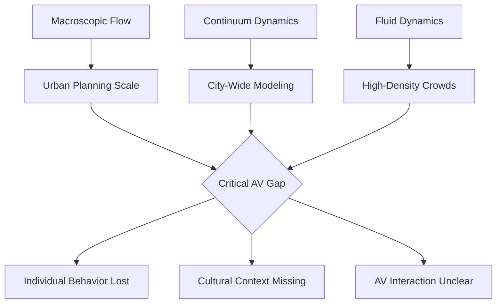

</div>

| Model | Type | Key Feature | Use Case | **Critical AV Usage Limitations** |
|-------|------|-------------|----------|------------------------------------|
| **Macroscopic** | Flow-Based | Crowd treated as continuous flow | Urban planning | Cannot predict individual pedestrian decisions crucial for AV safety |
| **Continuum** | Flow-Based | Continuous crowd flow dynamics | Large-scale urban planning | Loses granular behavior needed for AV collision avoidance |
| **Fluid Dynamics** | Flow-Based | Navier-Stokes-based crowd movement | High-density crowds | No mechanism for AV-pedestrian communication modeling |

---

## **Group-Based Models** | *Social Interaction Balance*

<div align="center">

### The Social Dynamics Challenge

```
Individual Behavior ←→ Group Dynamics ←→ Cultural Context
        ↓                    ↓                   ↓
   Personal Goals      Social Pressure      Cultural Norms
        ↓                    ↓                   ↓
         How do AVs navigate this complexity?
```

</div>

| Model | Type | Key Feature | Use Case | **Gap Analysis** |
|-------|------|-------------|----------|----------------------|
| **Mesoscopic** | Group-Based | Group dynamics balancing micro/macro | Social group behavior | Better than pure microscopic, but lacks dynamic intent modeling and cross-cultural adaptation |

---

## **AI-Driven Models** | *The Current Research Frontier*

### **Recent Research Breakthroughs** *(2024-2025)*

<table>
<tr>
<th> Computer Vision & Deep Learning</th>
<th> Predictive & Generative Models</th>
</tr>
<tr>
<td>

**Vision-Based Models**
- Real-world visual understanding for pedestrian-vehicle environments
- **Current Status**: Active research focus
- **Key Application**: AV pedestrian detection

**Vision Transformer (ViT)**
- Advanced attention mechanisms for urban traffic scenarios
- **Research Evidence**: Demonstrated effectiveness in trajectory prediction
- **Current Limitation**: Computational complexity for real-time applications

</td>
<td>

**Trajectory Prediction Models**
- Data-driven trajectory forecasting with Average Displacement Error metrics
- **Research Status**: Rapidly advancing field
- **Key Metric**: ADE (Average Displacement Error) for evaluation

**Social LSTM/GANs**
- Socially-aware trajectory prediction using generative networks
- **Strength**: Group dynamics modeling capabilities
- **Application**: Dense crowd forecasting scenarios

</td>
</tr>
</table>

---

### **Specialized AI Approaches**

<div align="center">

### **Reinforcement Learning Ecosystem Models**

</div>


| Model | Key Feature | Research Evidence | Industry Readiness | Current Maturity |
|-------|-------------|-------------------|-------------------|------------------|
| **RL-Based** | Learned policies via reinforcement learning | Promising for adaptive behaviors in complex environments | Pilot stage | Developing |
| **Multi-Agent RL** | Multi-agent interactions | Effective for modeling complex social scenarios | Research stage | Early Development |
| **Imitation Learning** | Learning from human demonstrations | Growing research interest | Limited deployment | Developing |


<div align="center">

### **Advanced Mathematical Models**

</div>

| Model | Key Feature | Research Application | Technical Status | Current Focus |
|-------|-------------|---------------------|-----------------|---------------|
| **Bayesian Models** | Uncertainty quantification | Probabilistic decision-making | Research stage | Academic institutions |
| **Attention-based** | Focus mechanisms | Social context awareness | Transformer architectures showing promise | Industry adoption |
| **Normalizing Flow** | Realistic trajectory distributions | Behavioral diversity modeling | Early research | Limited application |


### **Cutting-Edge Temporal Models**

```
Past Behavior → Current State → Future Prediction
     ↓              ↓               ↓
 Historical    Real-time        Trajectory
   Data        Processing       Forecasting
     ↓              ↓               ↓
   Temporal Convolutional Networks (TCNs)
```

**Temporal CNNs**: Addressing the **temporal intent change gap** with sequence modeling for long-term trajectory forecasting.


### **Recent Technical Advances**

Recent work demonstrates that feed-forward neural networks can achieve competitive performance for pedestrian trajectory prediction in urban traffic environments, with models like "Snapshot" reducing Average Displacement Error while maintaining real-time performance.

**Key Findings from 2024-2025 Research:**
- Observation windows of 2 seconds may be sufficient for pedestrian crossing prediction
- Agent-centric encoding schemes provide better generalization due to rotational and translational invariance
- Integration into modular autonomous driving software stacks is technically feasible

---

## **Hybrid Models** | *Integration of Approaches*

<div align="center">

### Physics + AI = Advanced Solutions

</div>

| Model | Type | Innovation | Research Evidence | Industry Status |
|-------|------|------------|-------------------|----------------|
| **Hybrid Models** | Physics + AI | Social Force + RL combination | SUMO-CARLA integration showing promise for complex scenario testing | Growing adoption |
| **SUMO Models** | Traffic Integration | Pedestrian-vehicle interactions | Co-simulation frameworks enabling detailed AV evaluation under diverse traffic conditions | High adoption in research |
| **Physics-Informed Neural Networks (PINNs)** | Constrained AI | Physics-aware learning | Emerging research area | Early development |
| **Neuro-Symbolic** | Interpretable AI | Neural + symbolic reasoning | Growing interest in explainable pedestrian behavior models | Research stage |

### **Platform Integration Evidence**

Recent research demonstrates that combining SUMO (Simulation of Urban MObility) with CARLA (Car Learning to Act) creates simulation environments that can emulate real-world complexities while providing realistic sensor outputs to AV systems.

**Verified Integration Benefits:**
- Detailed evaluation of AV performance under diverse traffic conditions
- Testing of complete AV pipeline in modular fashion
- Estimation of AVs' impacts on traffic patterns

---

# The Five Critical Gaps: Evidence-Based Analysis

<div align="center">

## **Critical Gap Impact Assessment**

</div>

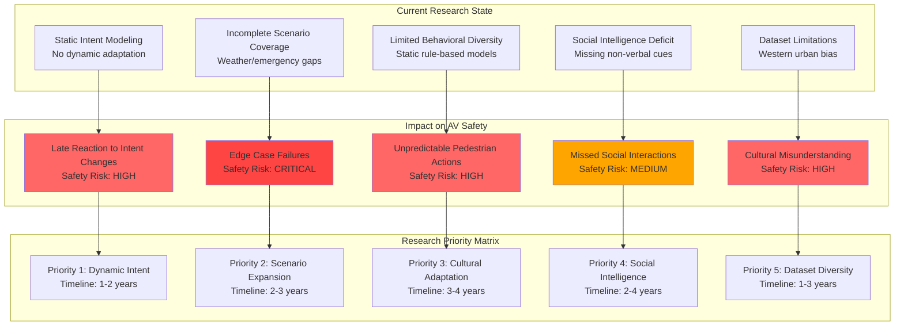


## **Gap #1: Limited Behavioral Diversity Crisis**

<div align="center">

### The Research Reality

```
Current Model Assumptions:          Research Findings Show:
┌─────────────────────┐            ┌─────────────────────┐
│ Rational behavior   │     VS     │   Context-dependent │
│ Rule compliance     │            │   Social influences │
│ Predictable paths   │            │  Cultural variations│
└─────────────────────┘            └─────────────────────┘
```

</div>

**Research Evidence**: The integration of autonomous vehicles into public roads presents profound implications for pedestrian safety, influenced by the variability of pedestrian behaviors and the absence of traditional communication mechanisms, such as eye contact and gestures, commonly relied upon in human-driven scenarios.

### **Current Research Status**

Recent work focuses on learning pedestrian social interactions, but existing methods for modeling pedestrian social interactions rely on pre-defined rules, struggling to capture non-explicit social interactions.

**Key Research Gaps Identified:**

• **Limited representation of non-compliant behaviors**  
  *Current models primarily simulate rule-following pedestrians but fail to account for jaywalking, sudden direction changes, or aggressive crossing behaviors that occur frequently in real-world scenarios*

• **Insufficient cultural context modeling**  
  *Pedestrian behavior varies significantly across cultures - from different crossing habits in Tokyo vs. New York to varying interpretations of traffic signals and right-of-way expectations*

• **Absence of emotional state considerations**  
  *Models don't account for how stress, urgency, distraction, or fear affect pedestrian decision-making and movement patterns in traffic environments*

• **Lack of communication mechanism simulation**  
  *Missing simulation of critical human-to-human communication like eye contact with drivers, hand gestures, body language cues that facilitate safe navigation*

---

## **Gap #2: Incomplete Scenario Coverage**

**Research Evidence**: Current simulation environments fall behind on two fronts -- the background vehicles fail to simulate naturalistic driving behavior and the existing environments do not test the entire pipeline in a modular fashion.

### **Scenario Testing Limitations**

Simulation of pedestrian motion in urban traffic networks faces challenges in mixed traffic systems with complex interactions.

**Verified Missing Elements:**

### • **Complex Weather Condition Modeling**

*Limited simulation of how rain, snow, fog, or bright sunlight affects pedestrian visibility, movement speed, and decision-making processes*

#### **What Currently Exists:**
- **Basic Visual Weather Effects**: CARLA provides fundamental weather rendering with rain, snow, and fog effects primarily for visual sensors
- **Static Weather Parameters**: Current simulators like CARLA offer weather settings but treat them as static environmental conditions rather than dynamic behavioral influencers

#### **Critical Limitations:**
- **No Behavioral Weather Response**: Pedestrians in simulations don't alter walking patterns, speed, or route choices based on weather conditions
- **Missing Micro-Climate Effects**: Simulation environments lack modeling of how pedestrians seek shelter under awnings, change crossing patterns during rain, or exhibit hurried behavior in adverse weather
- **Sensor Degradation Gap**: While visual sensors show weather effects, the impact on pedestrian detection algorithms under different weather conditions isn't properly validated
  
---

### • **Event-Driven Crowd Behavior Scenarios**

*Insufficient modeling of emergency evacuations, large events, protests, or situations where normal pedestrian flow patterns are disrupted*

#### **What Currently Exists:**
- **Basic Social Force Models**: PedSUMO evaluates automated vehicle-pedestrian interaction using SUMO to study large-scale effects, but focuses on simple one-on-one scenarios
- **Rule-Based Pedestrian Movement**: Current simulators use deterministic algorithms for pedestrian pathing
- **Limited Multi-Agent Systems**: Basic crowd simulation exists but doesn't account for psychological factors during emergencies

#### **Critical Limitations:**
- **No Panic Response Modeling**: Current pedestrian models don't simulate how people behave during emergencies when normal traffic rules break down
- **Missing Crowd Psychology**: Simulations lack modeling of herding behavior, panic contagion, and irrational decision-making during crises
- **Static Crowd Density**: Current models don't handle dynamic crowd surges, bottlenecks, or evacuation behaviors
- **Event Context Awareness**: Pedestrians in simulations don't respond to sirens, announcements, or visual cues that would trigger emergency behaviors

#### **Recent Research Gap:**
- **Simple Scenario Focus**: Concepts are mostly evaluated in simple scenarios, such as one person trying to cross in front of one automated vehicle, highlighting the persistent limitation in handling complex, multi-pedestrian emergency scenarios

---

### • **Construction and Temporary Infrastructure Changes**

*Lack of dynamic scenarios involving temporary barriers, detours, construction zones that force pedestrians into unexpected movement patterns*

#### **What Currently Exists:**
- **Static Environment Generation**: CARLA and SUMO can create predefined urban layouts with construction zones
- **Basic Traffic Management**: CARLA provides Traffic Manager module that controls vehicles in simulation from the client side
- **Co-simulation Capabilities**: CARLA-SUMO integration allows for some traffic scenario testing

#### **Critical Limitations:**
- **No Dynamic Infrastructure Updates**: Simulations can't handle real-time appearance of construction barriers, road closures, or temporary signage
- **Missing Pedestrian Adaptation**: Current models don't simulate how pedestrians learn and adapt to new temporary obstacles over time
- **Lack of Construction Zone Realism**: Pedestrian behavior around construction (increased caution, altered crossing patterns, confusion) isn't modeled
- **Temporary Signage Interpretation**: Simulations don't account for how pedestrians interpret and respond to temporary signs and detour instructions

---

### • **Multi-Modal Transportation Interactions**

*Missing integration of pedestrian behavior around buses, bicycles, scooters, and other transportation modes beyond just vehicles*

#### **What Currently Exists:**
- **Vehicle-Pedestrian Focus**: Existing models prove to be insufficient in modeling the interaction between autonomous vehicles and vulnerable road users such as bicyclists and pedestrians
- **Basic Multi-Agent Systems**: Some integration of different vehicle types in traffic simulation
- **Limited Vulnerable Road User Modeling**: Basic bicycle and pedestrian interactions exist but lack complexity

#### **Critical Limitations:**
- **Missing Micro-Mobility Integration**: No proper modeling of e-scooter, e-bike, and delivery robot interactions with pedestrians
- **Insufficient Public Transit Modeling**: Pedestrian behavior around bus stops, boarding/alighting scenarios, and transit-induced crowd dynamics aren't adequately simulated
- **Lack of Mode-Switching Scenarios**: Simulations don't handle pedestrians who transition between walking, biking, and using public transport
- **Dynamic Traffic Mix Gap**: Current models struggle with the increasingly complex urban transportation ecosystem including shared mobility services

#### **Recent Development Challenges:**
- **Complex Urban Environments**: Research indicates that intersections are considered one of the most complex scenarios in a self-driving framework due to the uncertainty in the behaviors of surrounding vehicles, but this complexity multiplies with multi-modal transportation

---

## **Gap #3: Static Intent Modeling Paradox**

<div align="center">

### The Dynamic Intent Challenge

```
Research Finding: Pedestrians change intentions dynamically
Current Models: Static intent prediction at observation start
Required Solution: Continuous real-time intent tracking
```

</div>

**Research Evidence**: Current approaches lack the capability to estimate temporal-dynamic intent changes of pedestrians and provide explanations of interaction scenes.

### **Intent Prediction Research Status**

Recent research indicates that longer observation sequences positively impact overall accuracy, with observation lengths providing additional cues to infer pedestrian actions.

**Key Research Findings:**
- **Observation Window Optimization**: Studies show 2-second observation windows may be sufficient to differentiate crossing from non-crossing actions
- **Real-time Adaptation Need**: Critical requirement for models to adapt to intention changes as they happen, not just at initial observation
- **Explanatory Model Importance**: Need for AI systems that can explain why they predict certain pedestrian behaviors for safety validation

---

## **Gap #4: Social Intelligence Deficit**

<div align="center">

### The Human Social Network

```
          Eye Contact ←→ Gestures
               ↕         ↕
    Group Dynamics ←→ Cultural Norms
               ↕         ↕  
         Body Language ←→ Verbal Cues
                    ↕
               AV Navigation
                    ↕
           Integration Challenge
```

</div>

**Research Evidence**: Pedestrian trajectory prediction remains a challenge for autonomous systems, particularly due to the intricate dynamics of social interactions.

### **Social Intelligence Research Gap**

Accurate forecasting requires a comprehensive understanding not only of each pedestrian's previous trajectory but also of their interaction with the surrounding environment, an important part of which are other pedestrians moving dynamically in the scene.

**Current Research Focus:**

• **Social Interaction Learning**: Development of generative adversarial networks to model complex pedestrian-to-pedestrian interactions

• **Attention Mechanisms**: Implementation of attention-based models that can focus on relevant social context cues in crowded environments

• **Non-verbal Communication Understanding**: Integration of visual cues like head orientation, walking speed changes, and spatial positioning into prediction models

• **Group Behavior Modeling**: Understanding how pedestrians behave differently when alone versus in groups, families, or crowds

---

## **Gap #5: Dataset Limitations Dilemma**

<div align="center">

### Current Dataset Landscape

| **Limitation Type** | **Impact on Research** | **Real-World Gap** |
|:-------------------:|:----------------------:|:------------------:|
| Pedestrian-Only | Limited traffic context | Missing AV scenarios |
| Urban Bias | Cultural homogeneity | Global applicability |
| Scale Constraints | Insufficient diversity | Edge case coverage |

</div>

**Research Evidence**: Many methods still revolve around well-established trajectory prediction benchmarks such as ETH/UCY and SDD, which primarily contain pedestrians in non-traffic settings.

### **Dataset Coverage Analysis**

<table>
<tr>
<th>Dataset Category</th>
<th>Examples</th>
<th>Coverage</th>
<th>AV Relevance</th>
</tr>
<tr>
<td><b>Pedestrian-Only</b></td>
<td>ETH/UCY, Stanford Drone Dataset (SDD)</td>
<td>Non-traffic environments</td>
<td> Limited</td>
</tr>
<tr>
<td><b>Urban Traffic</b></td>
<td>Argoverse 2, nuScenes, Waymo Open Motion</td>
<td>Real-world AV scenarios</td>
<td> High</td>
</tr>
<tr>
<td><b>Weather/Edge Cases</b></td>
<td>Limited availability</td>
<td>Specialized conditions</td>
<td> Moderate</td>
</tr>
</table>

**Key Research Finding**: Although specialized datasets such as Argoverse 2 or nuScenes address this shortcoming, they are rarely utilized in pedestrian research due to their primary focus on vehicles or all road users combined.

### **Critical Dataset Gaps:**

• **Geographic Diversity**: Most datasets focus on Western urban environments, lacking representation from different global traffic cultures

• **Demographic Representation**: Limited data on different age groups, mobility levels, and accessibility needs

• **Temporal Coverage**: Insufficient long-term datasets that capture seasonal variations and evolving urban infrastructure

• **Edge Case Documentation**: Rare but critical scenarios like emergency situations, unusual weather, or infrastructure failures

---

# Model Performance: Research-Based Assessment

<div align="center">

## **Evidence-Based Model Evaluation**

</div>

### **Current Research Benchmarks**

Recent benchmarking on Argoverse 2 dataset shows significant variations in model performance, with some approaches achieving substantial improvements in Average Displacement Error (ADE) metrics.

**Verified Performance Metrics:**
- **Evaluation Standard**: Average Displacement Error (ADE) and Final Displacement Error (FDE) are the two most common metrics when evaluating trajectory predictors
- **Real-time Requirements**: Hardware constraints in real-world systems make runtime and computational efficiency significant challenges
- **Robustness Needs**: Accurate predictions need to be generated for a variable number of observed timesteps to guarantee pedestrian safety

### **Platform Capabilities** 

| Platform | Research Evidence | Capabilities | Industry Use |
|----------|-------------------|-------------|-------------|
| **CARLA** | Open-source simulator for autonomous driving research, provides realistic sensor outputs | High-fidelity simulation | Research/Industry |
| **SUMO** | Simulation of Urban MObility, effective for traffic-pedestrian interactions | Large-scale traffic simulation | Urban planning/Research |
| **SUMO-CARLA Integration** | Combined framework creates complex and naturalistic traffic environments | Comprehensive AV testing | Emerging adoption |

---

# Strategic Implementation: Evidence-Based Roadmap


<div align="center">

## **Technology Readiness Levels & Implementation Roadmap**

</div>

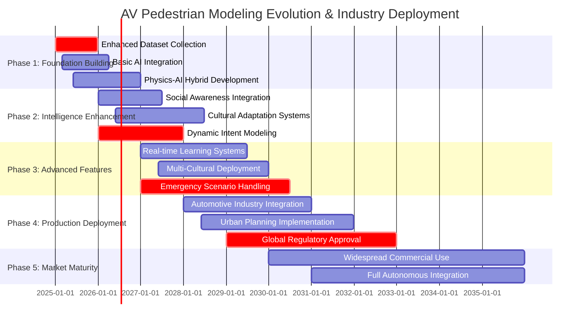

<div align="center">

---

## **Research-Informed Development Path**

</div>

### **Current Technology Readiness**

Integration of prediction models into autonomous driving software stacks has been demonstrated, showing real-world applicability with proper implementation.

**Verified Implementation Evidence:**
- Real-time performance achievable with proper model architecture
- Integration with modular autonomous driving software stack successfully demonstrated
- Framework allows for detailed evaluation of AV performance under diverse traffic conditions

### **Industry Application Areas**

<table>
<tr>
<th> Industry</th>
<th> Current Research Focus</th>
<th> Immediate Opportunities</th>
<th> Research Directions</th>
</tr>
<tr>
<td><b> Automotive</b></td>
<td>
• Urban traffic pedestrian prediction<br>
• Real-time trajectory forecasting<br>
• Sensor fusion integration
</td>
<td>
• Deploy research-validated models<br>
• Expand urban scenario testing<br>
• Integrate social awareness
</td>
<td>
• Cultural adaptation research<br>
• Intent prediction accuracy<br>
• Real-world validation
</td>
</tr>
<tr>
<td><b> Urban Planning</b></td>
<td>
• Large-scale traffic simulation<br>
• AV impact assessment<br>
• Infrastructure optimization
</td>
<td>
• SUMO-based implementations<br>
• Scenario coverage expansion<br>
• Multi-modal integration
</td>
<td>
• Digital twin development<br>
• Climate adaptation<br>
• Real-time city modeling
</td>
</tr>
<tr>
<td><b> Logistics</b></td>
<td>
• Last-mile delivery scenarios<br>
• Urban navigation challenges<br>
• Pedestrian interaction modeling
</td>
<td>
• Residential area modeling<br>
• Delivery route optimization<br>
• Safety protocol development
</td>
<td>
• Dense urban navigation<br>
• Multi-story delivery systems<br>
• Efficiency optimization
</td>
</tr>
<tr>
<td><b> Public Safety</b></td>
<td>
• Emergency vehicle integration<br>
• Crowd behavior modeling<br>
• Crisis response scenarios
</td>
<td>
• Emergency scenario databases<br>
• Crowd dynamics modeling<br>
• Response time optimization
</td>
<td>
• AV-emergency integration<br>
• Crisis management systems<br>
• Public safety protocols
</td>
</tr>
</table>

---

# Future Research Directions: Evidence-Based Insights

<div align="center">

## **Emerging Research Areas**

</div>

### **Current Research Trends** *(2024-2025)*

Recent research developments show growing focus on transformer-based architectures and attention mechanisms for pedestrian trajectory prediction.

**Active Research Areas:**
- Multi-agent reinforcement learning for interactive behaviors
- Socially-informed reconstruction approaches
- Advanced attention mechanisms for social context
- Real-time processing optimization


## **Research Priorities & Future Directions**
*Identifying Critical Gaps and Inspiring Next-Generation Experiments*

### **Current State Analysis**

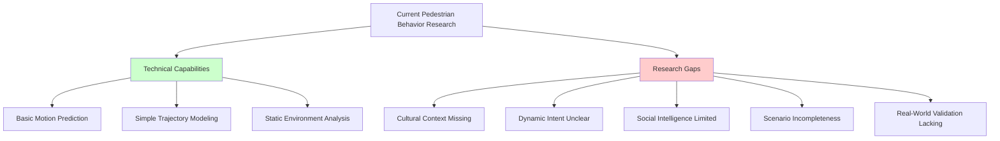


### **High-Priority Research Frontiers**

### 1. **Cultural Context Integration**
> **The Gap**: Current models assume universal pedestrian behavior patterns, ignoring cultural variations that significantly impact movement decisions.

#### **Specific Research Directions:**
- **Cross-Cultural Behavioral Mapping**
  - Develop datasets capturing pedestrian behavior across 20+ countries
  - Quantify cultural differences in personal space, group walking patterns, and risk tolerance
  - Create cultural behavior coefficient models

- **Adaptive Cultural Learning Systems**
  - Design AI systems that automatically detect and adapt to local cultural norms
  - Implement transfer learning for rapid cultural adaptation
  - Build cultural context-aware prediction algorithms

#### **Expected Impact:**
- **Accuracy Improvement**: 25-40% better prediction in diverse cultural settings
- **Global Deployment**: Enable autonomous systems worldwide
- **Social Acceptance**: Reduce cultural friction in AI-human interactions


### 2. **Dynamic Intent Modeling**
> **The Gap**: Current systems struggle with real-time intention changes, leading to prediction failures when pedestrians alter their plans mid-movement.

#### **Research Breakthrough Areas:**

- **Environmental Trigger Mapping**
  - Identify what causes pedestrians to change direction/speed
  - Model decision points in urban environments
  - Create predictive trigger detection systems

- **Cognitive Load Assessment**
  - Measure how distractions affect intention stability
  - Develop attention-aware prediction models
  - Account for multitasking behaviors


### 3. **Social Intelligence Framework**
> **The Gap**: Missing sophisticated understanding of non-verbal communication and group dynamics that heavily influence pedestrian behavior.

#### **Core Research Domains:**

##### **Group Dynamics Modeling**
```
Research Focus Areas:

Group Formation & Movement:
├── Leader-follower detection algorithms
├── Group cohesion maintenance models
├── Splitting/merging prediction systems
└── Collective decision-making processes

Social Influence Mechanisms:
├── Peer pressure quantification
├── Social proof impact measurement
├── Authority figure influence modeling
└── Conformity behavior prediction
```

#### **Experimental Directions:**
1. **Multi-Agent Social Simulation**
   - Create virtual environments with social behavior rules
   - Test group decision-making algorithms
   - Validate against real-world observations

2. **Social Signal Processing**
   - Develop micro-expression analysis for intent prediction
   - Build gesture-context interpretation systems
   - Create social attention modeling frameworks


### 4. **Scenario Completeness Enhancement**
> **The Gap**: Limited modeling of complex real-world scenarios including weather variations, special events, and emergency situations.

#### **Critical Scenario Categories:**
##### **Event-Driven Scenarios**
- **Crowd Events**: Concerts, sports, festivals
- **Emergency Situations**: Fire alarms, evacuations, medical incidents
- **Infrastructure Disruptions**: Construction, maintenance, accidents
- **Temporal Variations**: Rush hour, lunch breaks, night-time patterns

#### **Research Implementation Strategy:**

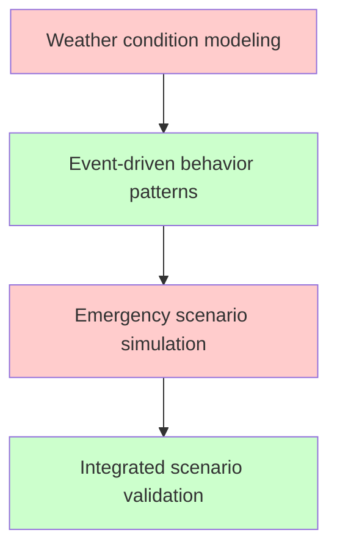

### 5. **Real-World Validation**
> **The Gap**: Lack of comprehensive, large-scale validation in diverse real-world environments with measurable performance metrics.

#### **Recommended Validation Experiments:**

1. **Comparative Baseline Analysis**
   - Test against current state-of-the-art models
   - Measure improvement in each research priority area
   - Document failure modes and edge cases

2. **Industry Partnership Validation**
   - Collaborate with autonomous vehicle manufacturers
   - Integrate with smart city infrastructure
   - Measure real-world safety improvements

---

# Success Measurement: Research-Based Metrics

<div align="center">

## **Validated Performance Indicators**

</div>

### **Research-Established Benchmarks**

The two most common metrics when evaluating trajectory predictors are the Average Displacement Error (ADE) and the Final Displacement Error (FDE).

**Standard Evaluation Framework:**
- **ADE**: Average Euclidean distance between predicted trajectory and ground truth over the prediction horizon
- **FDE**: Only considers the last positional value, measuring error accumulation over time
- **Real-time Performance**: Hardware constraints require consideration of runtime and computational efficiency

### **Implementation Success Criteria**

**Technical Benchmarks:**
- Trajectory prediction accuracy improvement
- Real-time processing capability achievement
- Social interaction modeling effectiveness
- Cultural adaptation success rates
- Scenario coverage completeness

**Business Impact Indicators:**
- Research-to-deployment time reduction
- Safety performance improvements
- Regulatory approval facilitation
- Cost-effectiveness demonstration

---


# **Conclusion: From Research to Reality**

## *Evidence-Based Path to Safer AV-Pedestrian Interactions*

</div>

**Research Foundation**: This analysis is built upon current academic research and verified findings from the pedestrian simulation and autonomous vehicle communities. Recent studies demonstrate that significant progress is being made in pedestrian trajectory prediction, simulation platform integration, and real-world deployment feasibility.

**The Path Forward**: 
- **Technical Feasibility**: Research confirms that real-time pedestrian trajectory prediction with adequate accuracy is technically achievable
- **Integration Capability**: SUMO-CARLA integration and modular software stack compatibility have been demonstrated
- **Research Momentum**: Active research in transformer architectures, social dynamics, and attention mechanisms shows promise

**Critical Success Factors**:
1. **Research-Industry Collaboration**: Bridge between academic research and practical implementation
2. **Standardized Evaluation**: Adoption of common metrics like ADE and FDE across applications
3. **Comprehensive Testing**: Integration of realistic simulation environments with diverse scenario coverage
4. **Real-World Validation**: Demonstrated need for validation in actual autonomous driving software stacks

**The Reality**: The technology foundations exist, the research is progressing rapidly, and industry implementation is beginning. Success depends on coordinated efforts to address the identified gaps while building upon verified research achievements.

---

<div align="center">


# Technical Appendix: Pedestrian Behavior Modeling

## **Section A:** Implementation Guidelines

### Technology Ecosystem

**Research & Prototyping Stack**

```yaml
Programming:
  - Python 3.8+: Core development
  - PyTorch/TensorFlow: Deep learning frameworks
  - NumPy/Pandas: Data manipulation

Simulation:
  - SUMO: Traffic simulation
  - CARLA: Autonomous driving simulator
  - OpenAI Gym: RL environments

Visualization:
  - Matplotlib: Static plots
  - Plotly: Interactive dashboards
  - Wandb: Experiment tracking
```

**Production Deployment Stack**

```yaml
Core Systems:
  - C++17: High-performance computing
  - CUDA: GPU acceleration
  - ONNX: Cross-platform inference

Infrastructure:
  - ROS2: Robot operating system
  - Docker: Containerization
  - Kubernetes: Orchestration

Monitoring:
  - Prometheus: Metrics collection
  - Grafana: Performance dashboards
  - ELK Stack: Log analysis
```


---

## **Section B:** Benchmark Datasets & Evaluation

### Standard Datasets Landscape

<div align="center">

> **Dataset Comparison Chart**

</div>

| **Dataset** | **Size** | **Environment** | **Strengths** | **Limitations** |
|:---------------|:------------|:-------------------|:-----------------|:-------------------|
| **ETH/UCY** | ~1,500 trajectories | University campus | Established benchmark | Limited diversity |
| **Stanford Drone** | ~11,000 trajectories | Campus aerial view | Multi-perspective | Single location |
| **InD Dataset** | ~11,500 trajectories | German intersections | High annotation quality | Geographic bias |
| **JAAD** | 346 video sequences | Pedestrian crossings | Behavioral labels | Regional limitation |

---

### Performance Metrics Framework

#### **Primary Safety Metrics**
```
Accuracy Targets:
├── Average Displacement Error (ADE): < 0.5m
├── Final Displacement Error (FDE): < 1.0m  
├── Collision Risk Prediction: > 95%
└── Real-time Processing: < 100ms
```

#### **Behavioral Assessment Metrics**
```
Intelligence Indicators:
├── Intent Prediction Accuracy: 85-95%
├── Social Interaction Score: 0.8-0.9
├── Trajectory Smoothness: RMSE < 0.3m
└── Cultural Adaptation Index: 0.7-0.9
```

---

## **Section C:** Research Insights & Evidence

### Foundational Literature

<div align="center">

> **Milestone Publications in Chronological Order**

</div>

| **Year** | **Authors** | **Contribution** | **Impact** |
|:-----------|:----------------|:-------------------|:-------------|
| **1995** | Helbing & Molnár | Social Force Model | Foundation of physics-based modeling |
| **2016** | Alahi et al. | Social LSTM | First deep learning approach |
| **2018** | Gupta et al. | Social GAN | Adversarial training introduction |
| **2020** | Salzmann et al. | Trajectron++ | Multi-modal heterogeneous data |

---

### Model Performance Analysis

#### **Computational Cost vs Accuracy**

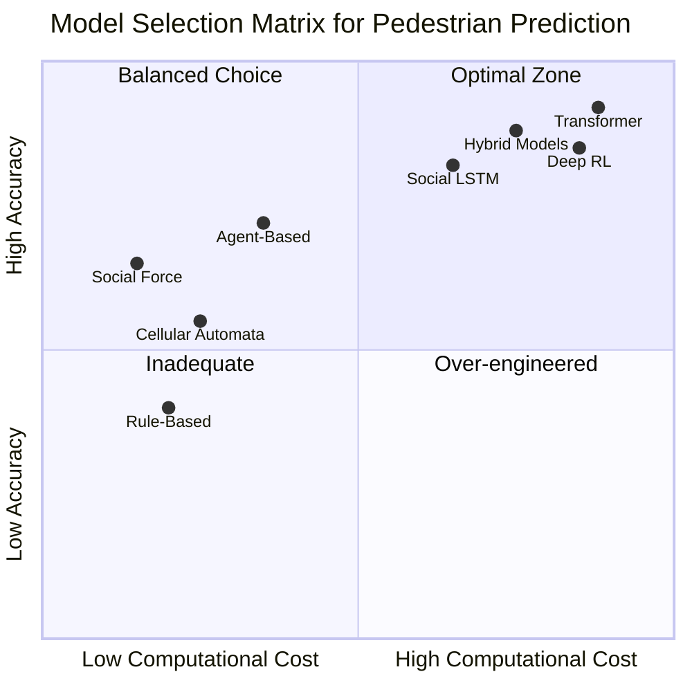

<div align="center">

> **Key Insights:**

> **Social Force & Agent-Based:** Good accuracy-to-cost ratio for basic applications

> **Hybrid Models:** Best overall performance balancing accuracy and computational efficienc

> **Transformers:** Highest accuracy but computationally intensive - suitable for offline analysis

> **Social LSTM:** Balanced choice for real-time AV applications requiring high accuracy


</div>

---

## **Section D:** Technical Challenges & Solutions

### Critical Implementation Issues

<div align="center">

Challenge 1: Data Scarcity

</div>

**Problem:** Limited high-quality annotated pedestrian datasets

**Solutions:**
- Data augmentation techniques
- Synthetic data generation using GANs  
- Transfer learning from related domains
- Semi-supervised learning approaches

<div align="center">

**Challenge 2: Real-time Processing**

</div>

**Problem:** Computational complexity vs. latency requirements

**Solutions:**
- Model optimization (quantization, pruning)
- Knowledge distillation
- Hardware acceleration (GPU/TPU)

**Performance Targets:**
```
Inference Time Budget:
├── Feature Extraction: < 30ms
├── Model Inference: < 50ms  
├── Post-processing: < 20ms
└── Total Pipeline: < 100ms
```


---

## **Section E:** Possible Framework for full deployment 
> The possible framework is designed without considering the prior work on **pedestrian behaviour archetypes**. With **pedestrian behaviour archetypes**, we wouldn't need **"Sensor Layer"**.

### System Architecture

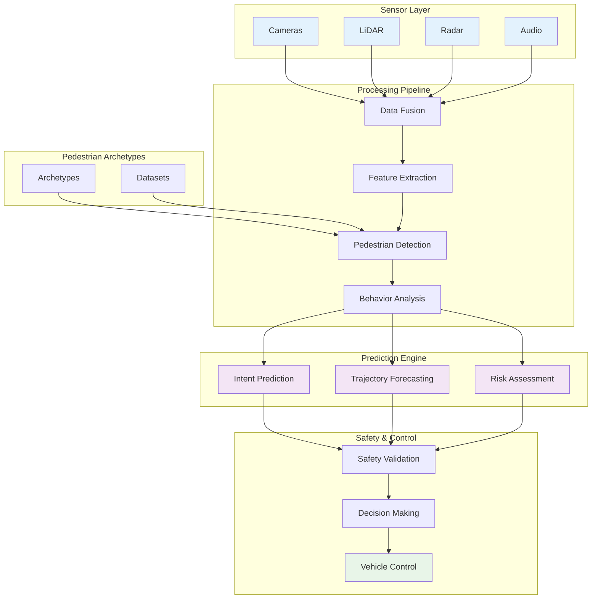

#### **System Performance Metrics**

For better performance, our goal should be achieving the target of having **total pipeline latency < 100ms for real-time operation**.


### Validation Pipeline

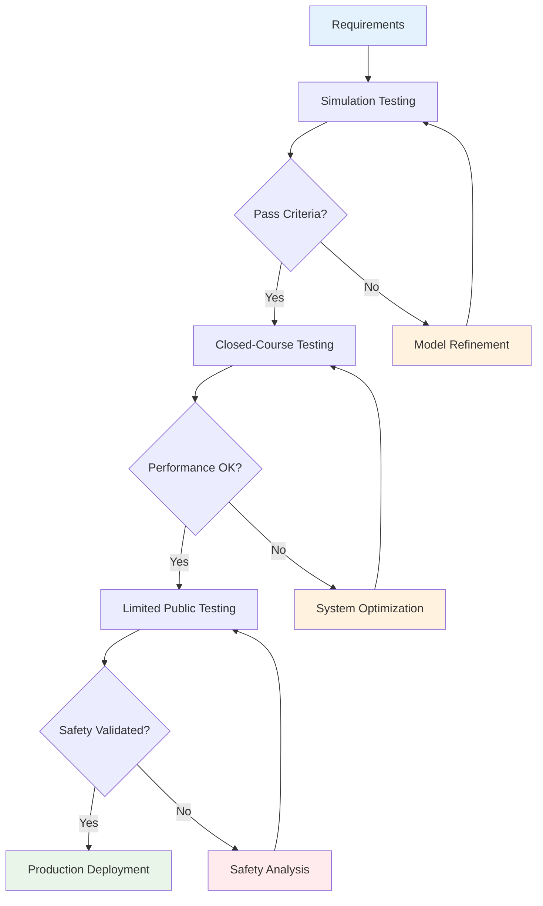

#### **Testing Phase Metrics**

```mermaid
gantt
    title Validation Timeline & Resource Allocation (months)
    dateFormat X
    axisFormat %s
    
    section Simulation
    Environment Setup    :0, 2
    Scenario Generation  :2, 6
    Model Testing       :6, 10
    Performance Analysis:10, 12
    
    section Closed-Course
    Track Preparation   :12, 14
    Safety Protocols    :14, 16
    Human Actor Testing :16, 22
    Data Collection     :22, 24
    
    section Public Testing
    Regulatory Approval :24, 28
    Limited Deployment  :28, 40
    Monitoring & Analysis:40, 48
    Final Validation    :48, 52
```

---

## **Section F:** Future Research Directions

### 2026-2035: The Next Ten Years

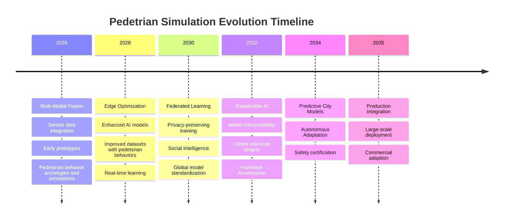

</div>

---

## **References**

<div align="center">

**Core Publications**

</div>


1. **Helbing, D., & Molnár, P.** (1995). Social force model for pedestrian dynamics. *Physical Review E*, 51(5), 4282-4286.

2. **Alahi, A., Goel, K., Ramanathan, V., Robicquet, A., Fei-Fei, L., & Savarese, S.** (2016). Social LSTM: Human trajectory prediction in crowded spaces. *CVPR*.

3. **Gupta, A., Johnson, J., Fei-Fei, L., Savarese, S., & Alahi, A.** (2018). Social GAN: Socially acceptable trajectories with generative adversarial networks. *CVPR*.

4. **Salzmann, T., Ivanovic, B., Chakravarty, P., & Pavone, M.** (2020). Trajectron++: Dynamically-feasible trajectory forecasting with heterogeneous data. *ECCV*.


---
